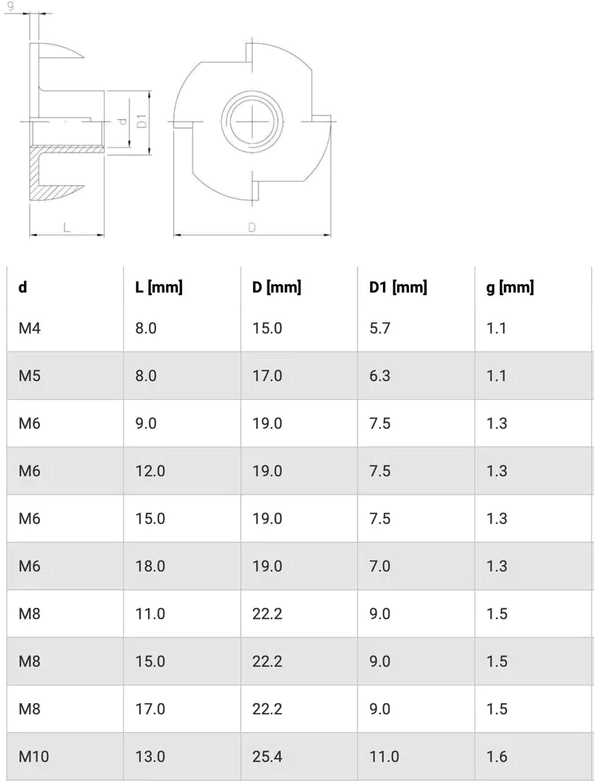

= Pronged T Nuts OpenSCAD library
:openscad_lib_name: pronged_t_nuts

This library depends on https://github.com/nophead/NopSCADlib[NopSCADlib] and can be used as a git submodule in NopSCADlib styled CAD projects:

[source, bash, subs=attributes+]
----
git clone submodule https://github.com/eraga/{openscad_lib_name} lib/{openscad_lib_name}
----

== Example usage

[source, openscad, subs=attributes+]
----
include <../libs/{openscad_lib_name}/{openscad_lib_name}s.scad>

pronged_t_nut(PRONGED_T_NUT_M8x17);
----

== About library

The models & dimensions are taken from
https://ss8.group/products/four-pronged-t-nuts-captive-threaded-inserts-for-wood-furniture-m4-m5-m6-m8-zinc[ss8.group] website.

